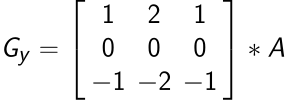

##  Innhaldsbevisst skalering

<!-- .slide: id="front-page" -->

Note:
Vis bilete. Før -> Etter.
paper publisert i 2005
Vore inkludert i adobe photoshop CS4 sidan 2008

----

----

<!-- .slide: class="tall_img" -->

----

<!-- .slide: class="tall_img" -->

---

## Konverter bilete til svart/kvitt

----

---

## Køyr kantdeteksjon

----

## Sobel Operator

---

## Finn og fjern saum

----

----

----

---

# Kjelder

* [Seam Carving Wikipedia](https://en.wikipedia.org/wiki/Seam_carving)
* Seam Carving for Content-Aware Image Resizing -  S. Avhdan, A. Shamir
* [Sobel Operator Wikipedia](https://en.wikipedia.org/wiki/Sobel_operator)
* Kode på github @abrabah
